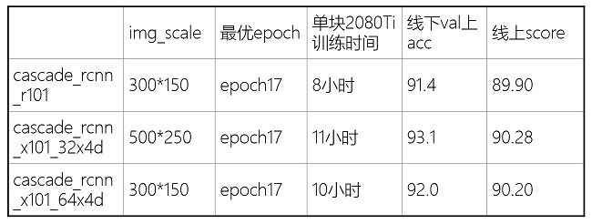

## 核心思路

用Cascade R-CNN做目标检测，分别训练cascade_rcnn_r101，cascade_rcnn_x101_32x4d，cascade_rcnn_x101_64x4d，三个模型结果一起做NMS

## 以下是技巧

1. 试了好几个网络，Cascade R-CNN似乎是mmdetection里效果最好的，啥也不改直接跑单模0.88+
2. 比赛提供的数据集划分方式是3万张训练，1万张验证，可以将验证集里的数据也加入训练集一起训练，单模可提升0.01~0.02
3. 目标检测的网络也可以做模型融合，每次训练前重新随机划分训练集和验证集，这样融合后相当于将全部数据用于训练，此外每次训练也可以将图片resize成不同大小，以训练不同尺度的网络，融合后可以在单模基础上提升0.02~0.03

## 以下是代码

先说说重新划分数据集
rename_val.py：因为验证集和训练集图片重名，放在一起训练需要先将验证集图片重命名

 split_train_val.py：随机划分90%的数据训练，10%的数据验证 

 preprocess.py：把划分后的新数据集做成coco数据集那个格式 

 然后预处理阶段就结束后了，就可以开始训练啦，这里主要用的是[mmdetection](https://github.com/open-mmlab/mmdetection)，mmdetection/mmdet/datasets/coco.py里的类别要记得改成0到9，mmdetection/configs/*base*/datasets/coco_detection.py里的文件路径要改好，img_scale也要改，我试了一下300x150和500x250都挺好的，虽然大佬告诉我这里应该写2的冥，比如256x128和512x256这样，我也不懂了，可以在mmdetection/configs/*base*/schedules/schedule_1x.py把训练的轮数写多一点，我试的大概是17轮比较好
训练的话用的这三个：
python tools/train.py configs/cascade_rcnn/cascade_rcnn_r101_fpn_20e_coco.py
python tools/train.py configs/cascade_rcnn/cascade_rcnn_x101_32x4d_fpn_20e_coco.py
python tools/train.py configs/cascade_rcnn/cascade_rcnn_x101_64x4d_fpn_20e_coco.py 

 再说说模型融合
比如下面这个是单模的检测代码，需要把结果写入一个json，做成{000000.png:[[x1,y1,x2,y2,置信度1,标签1],[x1,y1,x2,y2,置信度2,标签2]],000001.png:[[x1,y1,x2,y2,置信度1,标签1],[x1,y1,x2,y2,置信度2,标签2]]}这个格式，简单的说就是把单模测出来的每一个框的坐标置信度和标签都存起来，才能做后续的多模型NMS
inference_demo.py：单模的测试并且把结果json和csv存起来 

 我最最最核心的merge.py：多模型NMS处理，输出最终结果 

 多模型NMS后至少可以到0.92+，我这也没有想到居然目标检测还能做模型融合，我也尝试了投票，投票的效果没有这个好，此外我也挣扎了比如调整检测框和loss函数，还是融合提升容易且无脑，听说yolov5直接跑已经可以0.925，也听说前排有大佬单模上了0.94，其实如果单模提升了融合也依然会有不错的效果
